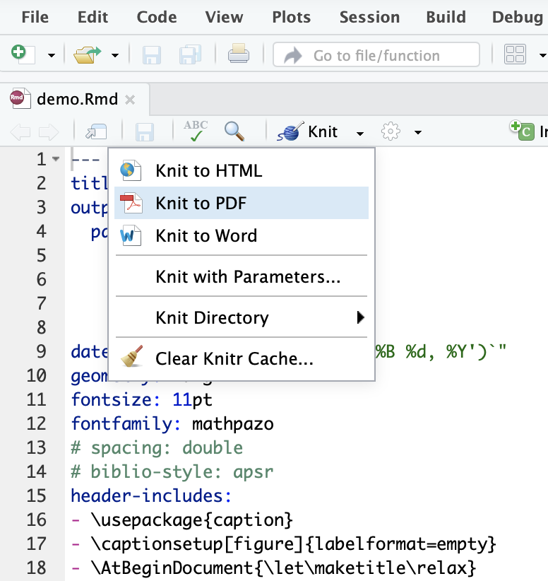

## Install R Markdown as an R library
In [RStudio](https://www.rstudio.com) terminal panel type:

    install.packages("rmarkdown")

then load it:

    library(rmarkdown)

* Open the `demo.Rmd` using RStudio
* There are two ways to render a PDF:
  * select `Knit` -> `Knit to PDF` in the menu

      

  * type `render("demo.Rmd")` in the terminal panel;

Check [this tutorial](https://rmarkdown.rstudio.com/lesson-1.html) for more R Markdown tutorial.
